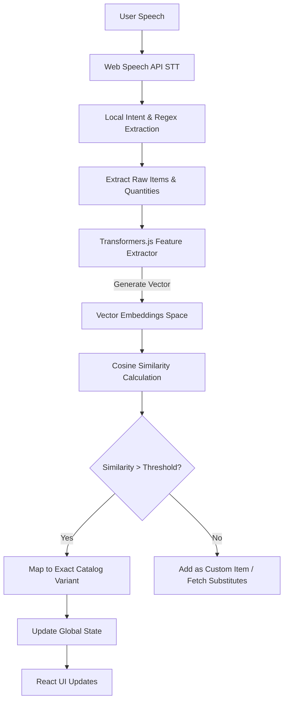
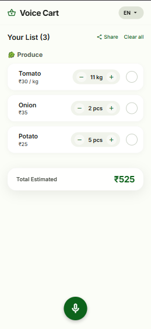
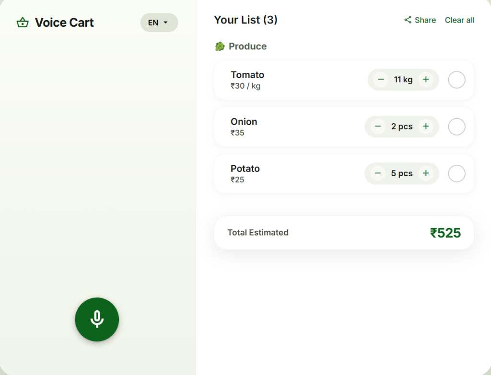
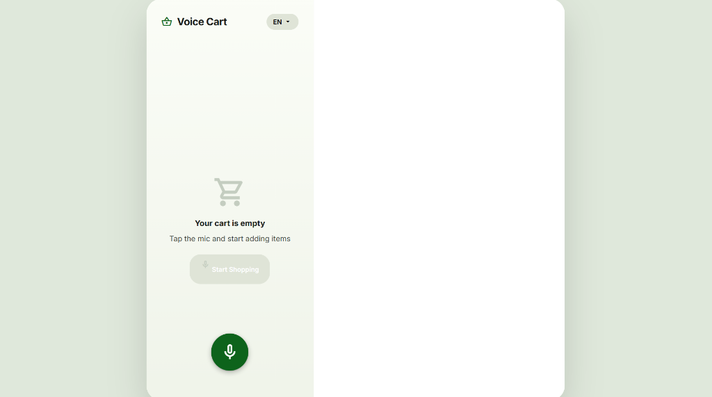

# Voice Cart - Voice Command Shopping Assistant

### 🚀 **Live Demo:** [voice-cart-phi.vercel.app](https://voice-cart-phi.vercel.app/)

Voice Cart is a fully voice-activated, multilingual shopping list manager designed for speed, privacy, and a seamless user experience. It leverages an advanced local NLP pipeline with an AI-powered fallback to understand complex shopping commands instantly. 

**✨ Fully Responsive**: Voice Cart features a beautiful, adaptive UI that supports both laptop and mobile dimensions natively. It automatically transforms from a mobile app experience into a spacious 2-column dashboard on larger screens.

## The Approach (Technical Write-up)

Our primary goal was to create an ultra-fast, offline-capable voice assistant that doesn't rely on slow, expensive Cloud LLM API calls for every user interaction. 

To achieve this, we engineered a robust, multi-stage **Local NLP Pipeline & Semantic Search Engine** running entirely in the browser using WebAssembly. When a user speaks a command, the pipeline:

1. **Segments and Extracts:** The text is parsed using a highly-optimized, **word-order agnostic** algorithm that perfectly extracts combinations like `Quantity-Unit-Item` ("2 kg onion") or `Item-Quantity-Unit` ("water 1 bottle") without strict syntax rules.
2. **Local Feature Extraction:** We load a quantized `paraphrase-multilingual-MiniLM` transformer model directly in the browser via **Transformers.js**.
3. **Semantic Matching via Cosine Similarity:** Instead of relying on exact string matches, the raw item name extracted from speech is converted into a high-dimensional vector. We then calculate the **Cosine Similarity** between this vector and our pre-computed product catalog embeddings. This allows the system to seamlessly snap fuzzy inputs (like "organic apples" or "colgate") to the correct database variant ("Apple" or "Colgate Toothpaste") even with typos, plurals, or missing adjectives.

This local approach delivers zero-latency intent classification and semantic entity resolution without sending data to the cloud. (An LLM API acts strictly as an extreme-edge-case fallback and for generating out-of-stock substitute recommendations).

### Architecture Flow



---

## Features Implemented

* **Voice Command Recognition:** Instantly parses commands like "Add 2 liters of milk".
* **Semantic Product Disambiguation:** Uses vector embeddings to handle brand variations. If you ask for a generic item (e.g., "Add toothpaste"), it prompts you to select a specific brand (Colgate vs Sensodyne). If you specify a brand, it instantly maps via Cosine Similarity.
* **Multilingual Support:** Understands items, numbers, and quantities spoken in English, Hindi, and several other regional languages using a local alias dictionary.
* **Smart List Management:** Automatically categorizes items (Dairy, Produce, Snacks, etc.) and allows precise quantity modifications via voice ("change milk to 3 liters").
* **Voice-Activated Search & Price Filters:** Ask the app to "find toothpaste under $5" or "under 50 rupees" and it processes the currency constraints instantly via local regex.
* **Minimalist Adaptive UI:** Clean, responsive UI with real-time visual feedback and native Web Share API support to easily export your list to WhatsApp/SMS.

## Demo Screenshots

<p align="center">
  
  
</p>
<p align="center">
  
</p>

## Tech Stack

* Frontend: React, TypeScript, Vite
* State Management: Zustand
* Styling: Vanilla CSS (Material Design 3 system)
* Voice & NLP: Web Speech API, Custom Local NLP Entity Extractor, Gemma LLM (Fallback & Suggestions)

## Getting Started

1. Clone the repository:
   ```bash
   git clone https://github.com/Harshitmishra001/voice-cart.git
   cd voice-cart
   ```

2. Install dependencies:
   ```bash
   npm install
   ```

3. Start the development server:
   ```bash
   npm run dev
   ```

4. Build for production:
   ```bash
   npm run build
   ```
