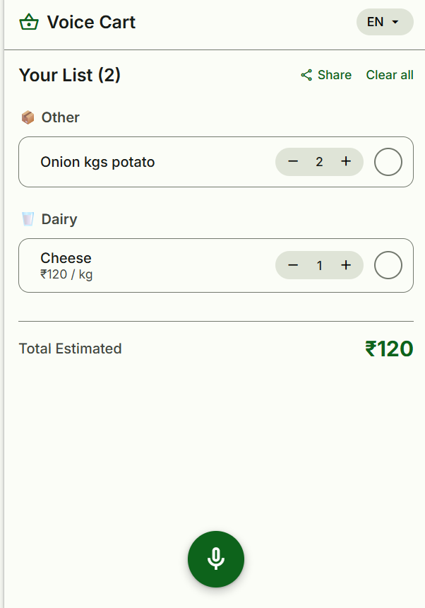
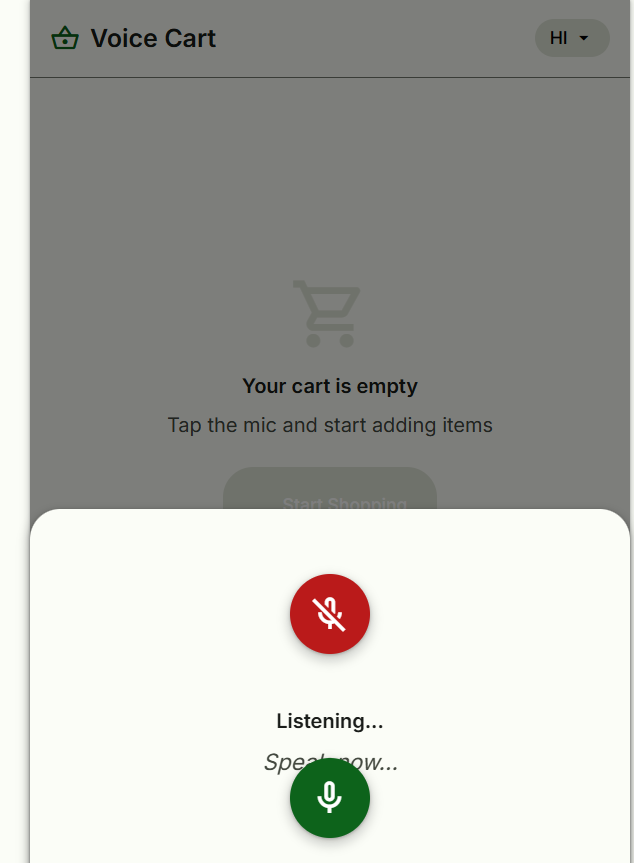
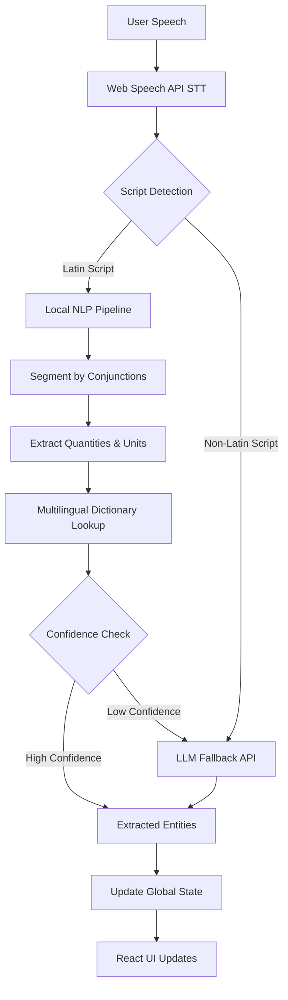

# Voice Cart - Voice Command Shopping Assistant

<p align="center">
  
  
</p>

Voice Cart is a fully voice-activated, multilingual shopping list manager designed for speed, privacy, and a seamless user experience. It leverages an advanced local NLP pipeline with an AI-powered fallback to understand complex shopping commands instantly.

## The Approach (Technical Write-up)

Our primary goal was to create an ultra-fast, offline-capable voice assistant that doesn't rely entirely on slow, expensive LLM API calls for every user interaction. 

To achieve this, we engineered a robust, multi-stage Local NLP Pipeline running entirely in the browser. When a user speaks a command, the pipeline:
1. Segments the speech using multilingual conjunctions (e.g. "and", "aur", "mattu").
2. Extracts Entities using a highly-optimized, **word-order agnostic** algorithm that perfectly parses combinations like `Quantity-Unit-Item` ("2 kg onion") or `Item-Quantity-Unit` ("water 1 bottle") without strict syntax rules.
3. Resolves Items against a multi-language food dictionary (supporting English, Hindi, Tamil, Telugu, etc., including native Devanagari script support for offline parsing).

This local approach delivers zero-latency intent classification and entity extraction. As a safety net, if the user constructs highly unusual phrasing that drops below our confidence threshold, the system intelligently fails over to an LLM API Fallback (Gemma) to parse the structured data. This hybrid approach guarantees both instant performance and maximum accuracy.

### Architecture Flow



---

## Features Implemented

* Voice Command Recognition: Instantly parses commands like "Add 2 liters of milk".
* Advanced NLP: Understands variations like "I want to buy bananas" vs "Add bananas to my list".
* Multilingual Support: Understands items, numbers, and quantities spoken in English, Hindi, and several other regional languages.
* Smart Suggestions & Substitutes: Uses AI to suggest complementary items based on your cart, and offers alternative products if an item is out of stock.
* Smart List Management: Automatically categorizes items (Dairy, Produce, Snacks, etc.) and allows precise quantity modifications via voice ("change milk to 3 liters").
* Voice-Activated Search: Ask the app to "find organic apples under 5 dollars" and it returns voice-filtered results.
* Minimalist Mobile UI: Clean, responsive UI with real-time visual feedback and native Web Share API support to easily export your list to WhatsApp/SMS.

## Tech Stack

* Frontend: React, TypeScript, Vite
* State Management: Zustand
* Styling: Vanilla CSS (Material Design 3 system)
* Voice & NLP: Web Speech API, Custom Local NLP Entity Extractor, Gemma LLM (Fallback & Suggestions)

## Getting Started

1. Clone the repository:
   ```bash
   git clone https://github.com/Harshitmishra001/voice-cart.git
   cd voice-cart
   ```

2. Install dependencies:
   ```bash
   npm install
   ```

3. Start the development server:
   ```bash
   npm run dev
   ```

4. Build for production:
   ```bash
   npm run build
   ```
